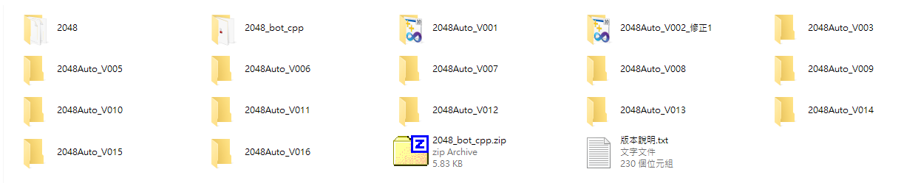
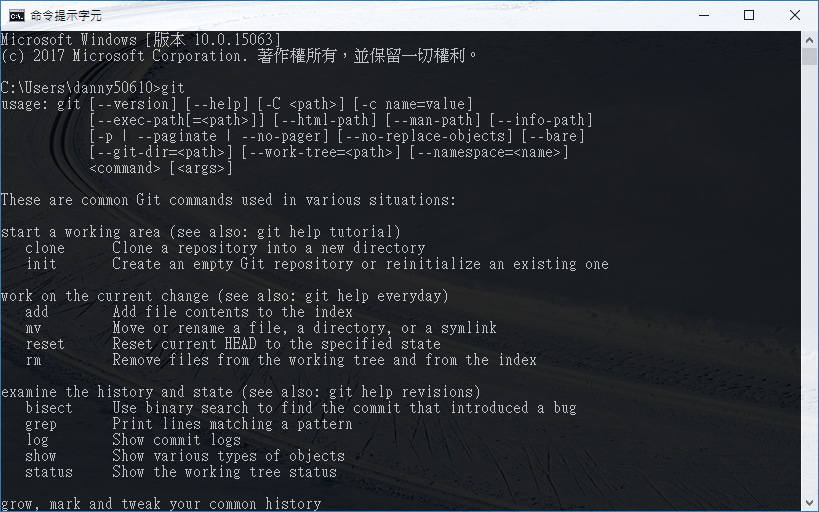

# Git
Git 是一個分散式版本控制軟體  
目的是能夠追蹤程式碼的變更紀錄  
以及方便同步程式碼  

基本上使用Git有幾個好處
* 基本上不會出現`code_v1.zip`、 `code_v2.zip`、 `code_v3.zip` ...
> 例如這個，這是參加2048 BOT的比賽程式  
> 重點是，當初一開始還想說沒必要 git  
> 等我想用的時候就變這樣了  
> 
* 多人合作下(可能是兩個不同人，或是昨天的你與今天的你)，容易使雙方的code一致
* 由於每位開發者都有一份code，就算其中一人的電腦遺失，可以從其他人的電腦還原

當然，有利就有弊，以下是Git常見的缺點：
* 學習曲線高：
  如果是第一次接觸版本控制，在操作上比較有難度，因為對原理不熟悉
* 不能處理太大的檔案，像是超過 10MB 的檔案

## 安裝
安裝非常簡單，只需要到官網：https://git-scm.com/  
下載 Windows 版來安裝就好

安裝完成後，打開 cmd 下 git 指令試試
應該會看到如下圖的說明

