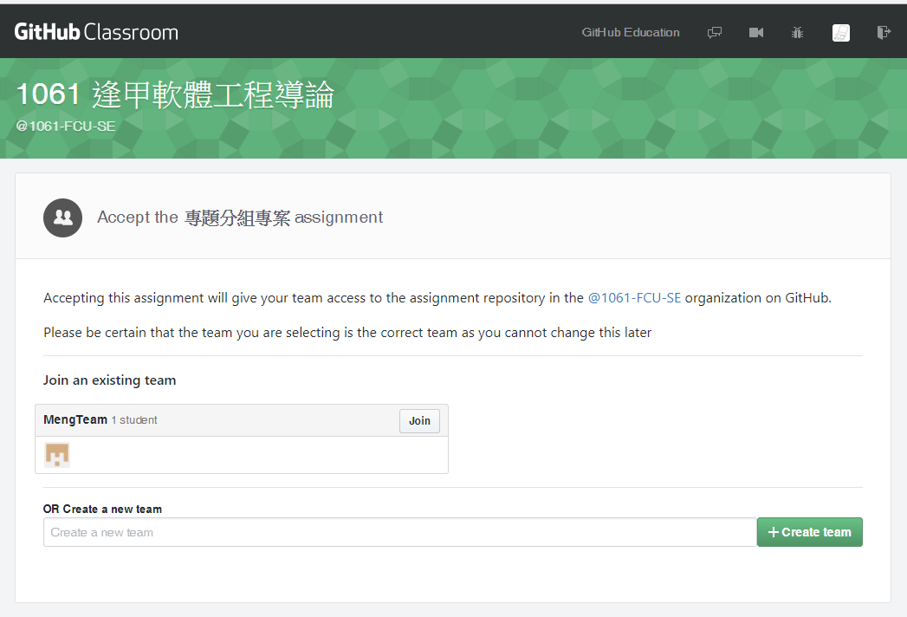
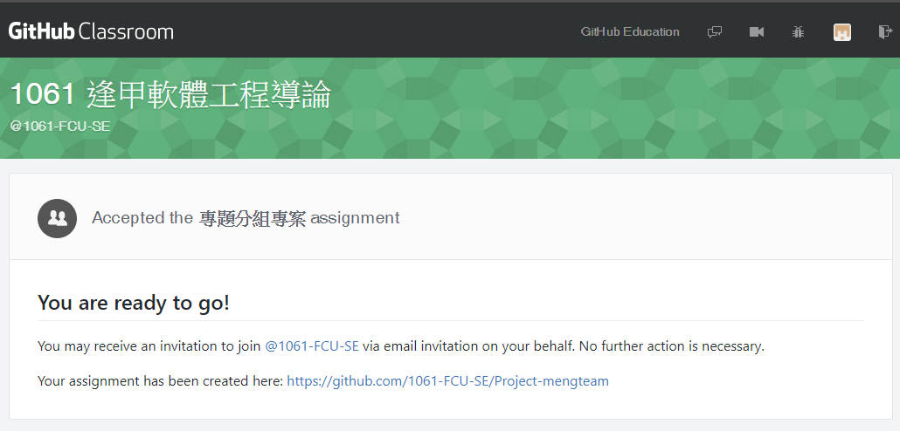
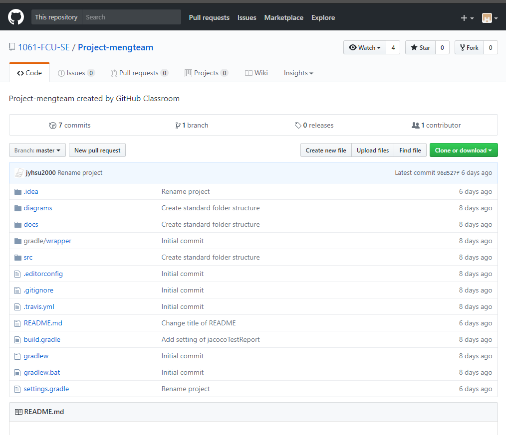
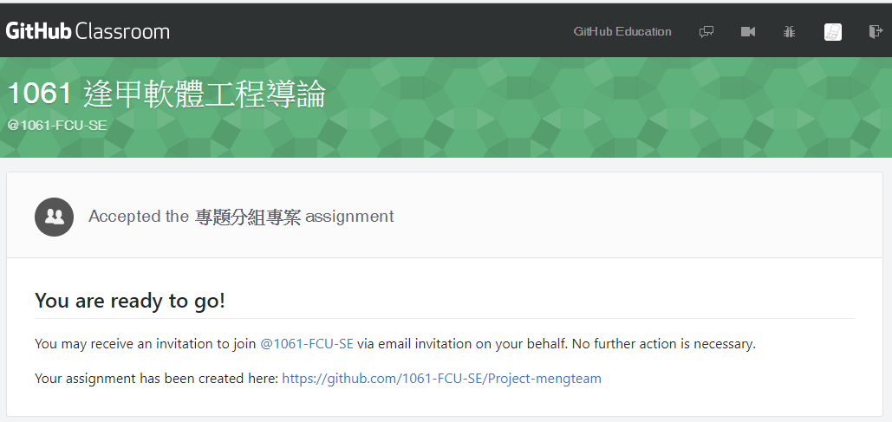

# GitHub 基本用法
- [帳號註冊](#帳號註冊)
- [建立與加入隊伍](#建立與加入隊伍)
- [上傳檔案](#上傳檔案)

## 帳號註冊
1. 進入 [GitHub](https://github.com/) 網站
2. 填寫 `Username`、`Email`、`Password` ，並點擊 `Sign up for GitHub` 註冊帳號  

3. 選擇 `Unlimited public repositories for free.` 並點擊 `Continue` 進入下一步  

4. 填寫問卷或直接跳過  

5. 請記得到信箱點擊驗證連結  

6. 完成後會看到以下畫面

## 建立與加入隊伍
1. 點擊 iLearn 所公布之超連結  

2. 進入 OAuth 授權頁面，點擊 `Authorize github` 進行授權  

3. 進入 GitHub Classroom 頁面後，可以建立隊伍或加入隊伍，  

    - 建立隊伍
        1. 輸入隊伍名稱，並點擊 `Create team` 即可建立隊伍  

        2. 出現以下畫面，代表隊伍已建立完成  

        3. 同時，系統已自動建立隊伍作業專案  

    - 加入隊伍
        1. 找到想加入的隊伍，點擊 `Join` 即可加入隊伍  

        2. 出現以下畫面，代表已經加入隊伍，此時即可存取隊伍作業專案  

## 上傳檔案
1. 進入隊伍作業專案  

2. 進入欲上傳檔案之路徑，點擊右上方的 `Upload files`  

3. 進入上傳介面  

4. 選擇檔案，並於 Commit changes 填寫 commit message 之後，點擊 `Commit changes`  

5. 上傳後，即可於該路徑看到上傳之檔案  

