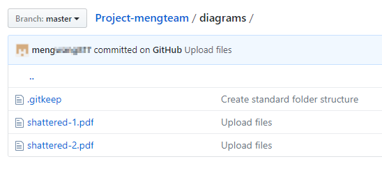

# 1061 軟工 Term Project GitHub 操作手冊
- [GitHub帳號註冊](#GitHub帳號註冊)
- [建立小組專案](#建立小組專案)
- [將其他組員設定為協作者](#將其他組員設定為協作者)
- [上傳檔案](#上傳檔案)

## GitHub帳號註冊
1. 進入 [GitHub](https://github.com/) 網站
2. 填寫 `Username`、`Email`、`Password` ，並點擊 `Sign up for GitHub` 註冊帳號  

3. 選擇 `Unlimited public repositories for free.` 並點擊 `Continue` 進入下一步  

4. 填寫問卷或直接跳過  

5. 請記得到信箱點擊驗證連結  

6. 完成後會看到以下畫面

## 建立小組專案
1. 進入課程提供之專案  

2. 按下 `Fork` ，若出現以下視窗，請選擇自己的帳號  

3. 等待專案建立  

3. 進入剛建立的專案，由專案名稱確認，該專案是由課程提供之專案fork出來的  

## 將其他組員設定為協作者
1. 點擊 `Settings` → `Collaborators` 進入協作者設定頁面  

2. 輸入隊員帳號，並按下 `Add collaborator`  

3. 等待隊員接受邀請  
（可請隊員收信並點擊通知信件中的連結，或點擊 `Copy invite link` 複製連結請隊員點擊）  
  

4. 隊員點擊 `Accept invitation` 接受邀請連結，並成為協作者  

5. 當隊員看到以下訊息，即表示已成為該專案之協作者  

## 上傳檔案
1. 進入隊伍作業專案  

2. 進入欲上傳檔案之路徑，點擊右上方的 `Upload files`  

3. 進入上傳介面  

4. 選擇檔案，並於 Commit changes 填寫 commit message 之後，點擊 `Commit changes`  

5. 上傳後，即可於該路徑看到上傳之檔案  

